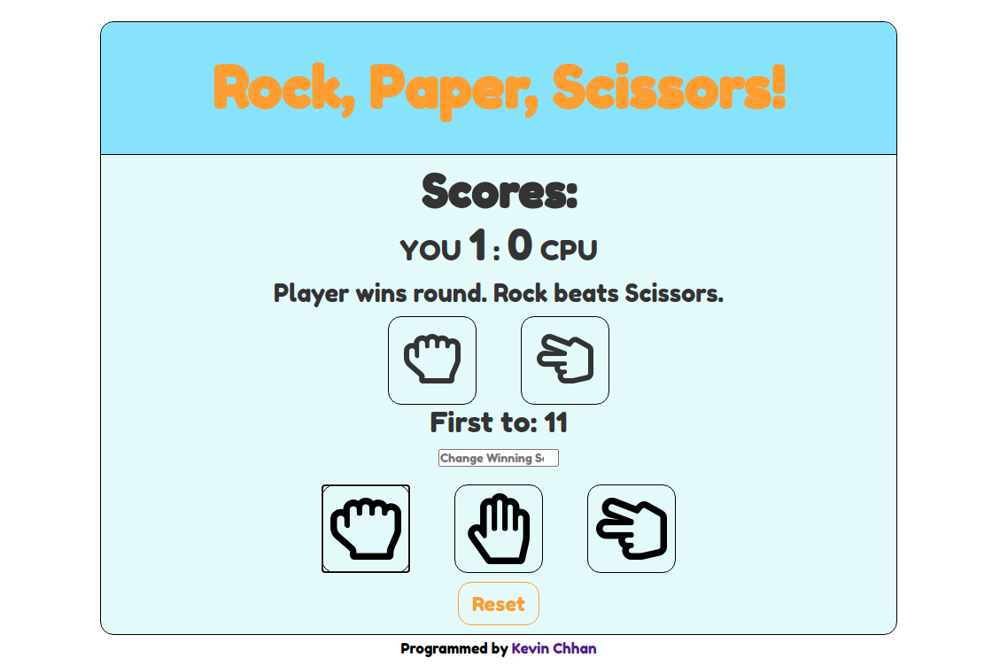

# Rock Paper Scissors Game Against AI

Live Site: https://kchhan.github.io/rock-paper-scissors/

---

## Tools Used:

- HTML5
- CSS3
- JavaScript

---

## My Learning Outcomes:

- [x] Utilize the Module Pattern for better organization and readablity
  - [x] Understand locally scoped object literals within modules
  - [x] Recude the number of gloabal variables to avoid namespacing
- [x] DOM manipulation to show data state

---

This project is part of The Odin Project curriculum found here:  
https://www.theodinproject.com/courses/web-development-101/lessons/rock-paper-scissors